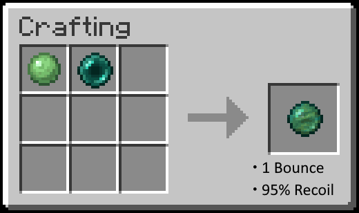

# Bouncy Enderpearls Datapack
_Created by FancyPotatOS_

Adds bouncy enderpearls, which can be crafted with a wide number of bounces!

Resource pack needed to see the Bouncy Enderpearls, otherwise they look like snowballs.

To craft, place an enderpearl into a crafting table with as many slimeballs as you want bounces.

Each bounce will conserve only 95% the Enderpearl's velocity. By including a Rabbit's Foot in the crafting recipe, you can add 10% of the Enderpearl's velocity back. This effect stacks, so adding 3 Rabbit's Feet will be 95% + 3 * 10% = 125% velocity for each bounce:

And any combination of the two!

